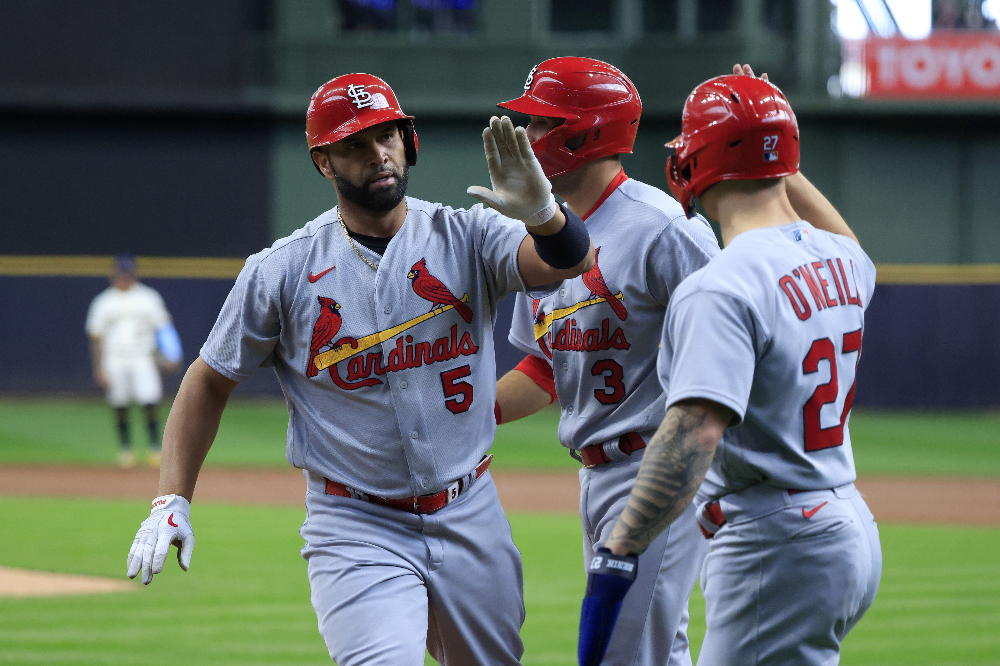

<!DOCTYPE html>
<html>
<head>
Mason Kirchhoefer
</head>
<body>

<h1>Cardinals</h1>

Picture of the St. Louis Cardinals

 
 
 
 <a href= "index.MD">Link to page 1 </a>  
 <a href= "Page One.MD">Link to page 2 </a>  
 <a href= "Page Two.MD">Link to page 3 </a>  
 <a href= "Page Three.MD">Link to page 4 </a>   
 <a href= "Page Four.MD">Link to page 5 </a>  
 
</body>
</html>
